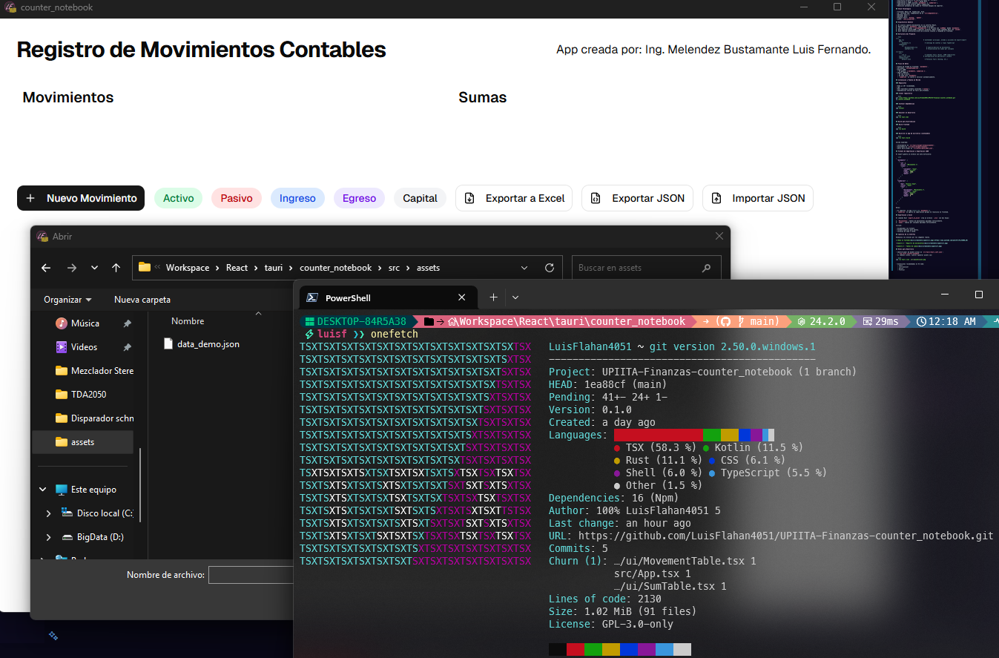
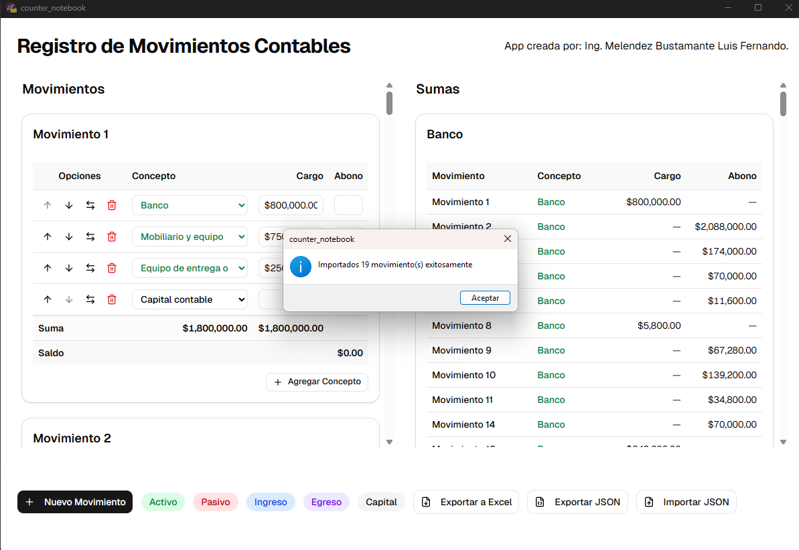
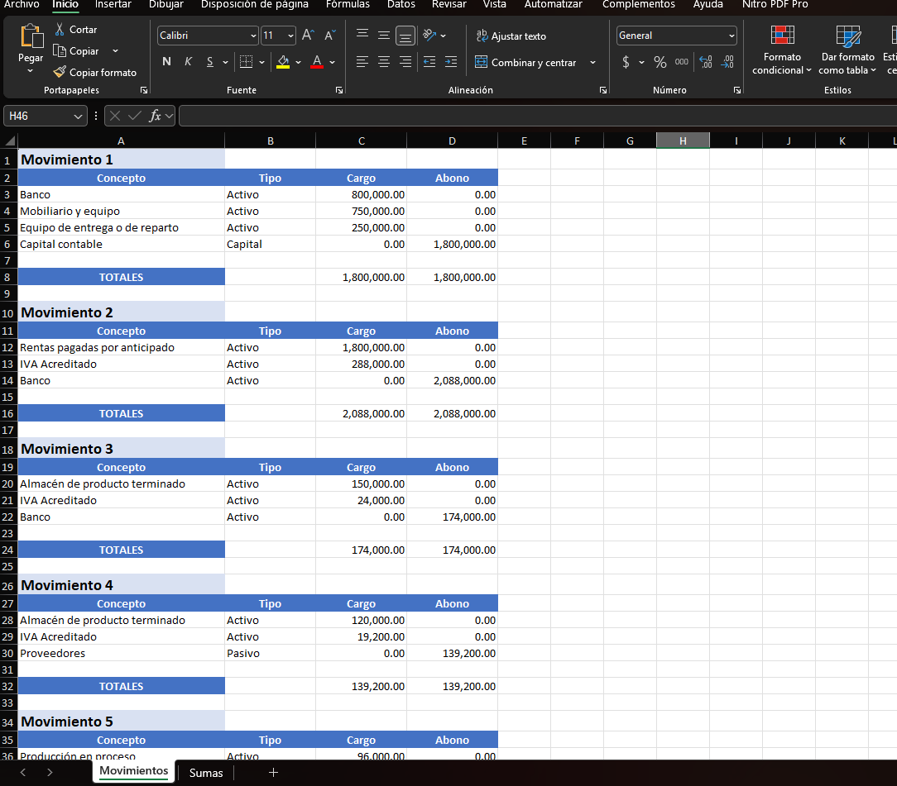

# Counter Notebook

Aplicacion de escritorio para registrar movimientos contables, visualizar tablas de sumas por concepto y exportar informacion a Excel o JSON.

El proyecto usa **React + TypeScript** en el frontend y **Tauri + Rust** en el backend.

## Contenido

- [Caracteristicas](#caracteristicas)
- [Stack Tecnologico](#stack-tecnologico)
- [Arquitectura General](#arquitectura-general)
- [Estructura del Proyecto](#estructura-del-proyecto)
- [Flujo de Datos](#flujo-de-datos)
- [Instalacion y Puesta en Marcha](#instalacion-y-puesta-en-marcha)
- [Build para Distribucion](#build-para-distribucion)
- [Formato de Importacion y Exportacion JSON](#formato-de-importacion-y-exportacion-json)
- [Exportacion a Excel](#exportacion-a-excel)
- [Capturas de la Interfaz](#capturas-de-la-interfaz)
- [Notas para Desarrollo](#notas-para-desarrollo)

## Caracteristicas

- Registro dinamico de movimientos contables.
- Edicion de lineas por movimiento (`concepto`, `tipo`, `cargo`, `abono`).
- Generacion automatica de tablas de sumas por concepto.
- Exportacion a Excel (`.xlsx`) desde Rust.
- Exportacion a JSON (incluye `movements` y `summaries`).
- Importacion desde archivo JSON o TypeScript.
- Recalculo automatico de sumas en frontend despues de importar.

## Stack Tecnologico

- Frontend: React 19, TypeScript, Vite.
- UI: Tailwind CSS, componentes UI en `src/components/ui`.
- Desktop: Tauri 2.
- Backend: Rust.
- Plugins Tauri: `dialog`, `opener`.
- Excel: `rust_xlsxwriter`.

## Arquitectura General

1. El usuario captura movimientos en la interfaz React.
2. React mantiene `movements` como estado principal.
3. Las tablas de sumas (`conceptSummaries`) se derivan con `useMemo` desde `movements`.
4. Para exportar Excel/JSON o importar archivos, React llama comandos Rust con `invoke`.
5. Rust realiza lectura/escritura de archivos locales y responde al frontend.

## Estructura del Proyecto

```text
src/
	App.tsx                          # Contenedor principal, estado y acciones de export/import
	data/
		movements.ts                   # Catalogo de cuentas y tipos TypeScript
	components/
		ui/
			MovementTable.tsx            # Captura/edicion de movimientos
			SumTable.tsx                 # Visualizacion de sumas por concepto

src-tauri/
	src/
		lib.rs                         # Comandos Tauri (Excel, JSON read/write)
	tauri.conf.json                  # Configuracion de aplicacion y bundle
	capabilities/
		default.json                   # Permisos Tauri (dialog, etc.)
```

## Flujo de Datos

- Fuente de verdad en frontend: `movements`.
- Derivados: `conceptSummaries`.
- Export JSON:
  - Se genera `{ movements, summaries }`.
- Import JSON/TS:
  - Se lee archivo.
  - Se toma solo `movements`.
  - `summaries` se vuelve a calcular automaticamente.

## Instalacion y Puesta en Marcha

### Requisitos

- Node.js 20+ recomendado.
- npm.
- Rust toolchain estable instalado (`rustup`).
- Dependencias nativas de Tauri para Windows.

### Clonar repositorio

```bash
git clone https://github.com/LuisFlahan4051/UPIITA-Finanzas-counter_notebook.git
cd counter_notebook
```

### Instalar dependencias

```bash
npm install
```

### Ejecutar en desarrollo

```bash
npm run tauri dev
```

## Build para Distribucion

### Build frontend

```bash
npm run build
```

### Build de la app de escritorio (instalable)

```bash
npm run tauri build
```

Salida esperada:

- Instaladores en `src-tauri/target/release/bundle/`.
- Ejecutable en `src-tauri/target/release/`.
- Datos para probar en `src/assets/data_demo.json`.

## Formato de Importacion y Exportacion JSON

El export genera un archivo con esta estructura:

```json
{
  "movements": [
    {
      "id": 1,
      "title": "Movimiento 1",
      "lines": [
        {
          "concepto": "Caja",
          "type": "Activo",
          "cargo": 1000,
          "abono": ""
        }
      ]
    }
  ],
  "summaries": [
    {
      "key": "Activo::Caja",
      "title": "Caja",
      "rows": [
        {
          "movimiento": "Movimiento 1",
          "concepto": "Caja",
          "type": "Activo",
          "cargo": 1000,
          "abono": 0
        }
      ]
    }
  ]
}
```

Notas:

- Al importar, la app **solo usa `movements`**.
- `summaries` se ignora en importacion porque se recalcula en frontend.

## Exportacion a Excel

El comando Rust `export_to_excel` crea un archivo `.xlsx` con dos hojas:

1. `Movimientos`: tablas de movimientos apiladas verticalmente.
2. `Sumas`: tablas por concepto apiladas verticalmente.

Incluye:

- Encabezados con formato.
- Formato numerico para montos.
- Formulas de suma y saldo.

## Capturas de la Interfaz

Reemplaza los enlaces por tus imagenes reales.

[](https://youtu.be/enp9OUg5y80)





## Notas para Desarrollo

- Identificador de bundle actual en `src-tauri/tauri.conf.json`:
  - `com.luisf.counter-notebook`
- Si cambias iconos, vuelve a generar assets con:

```bash
npm run tauri icon .\src\assets\icon.png
```

- Extensiones recomendadas en VS Code:
  - Tauri
  - rust-analyzer
  - ESLint
  - Prettier
